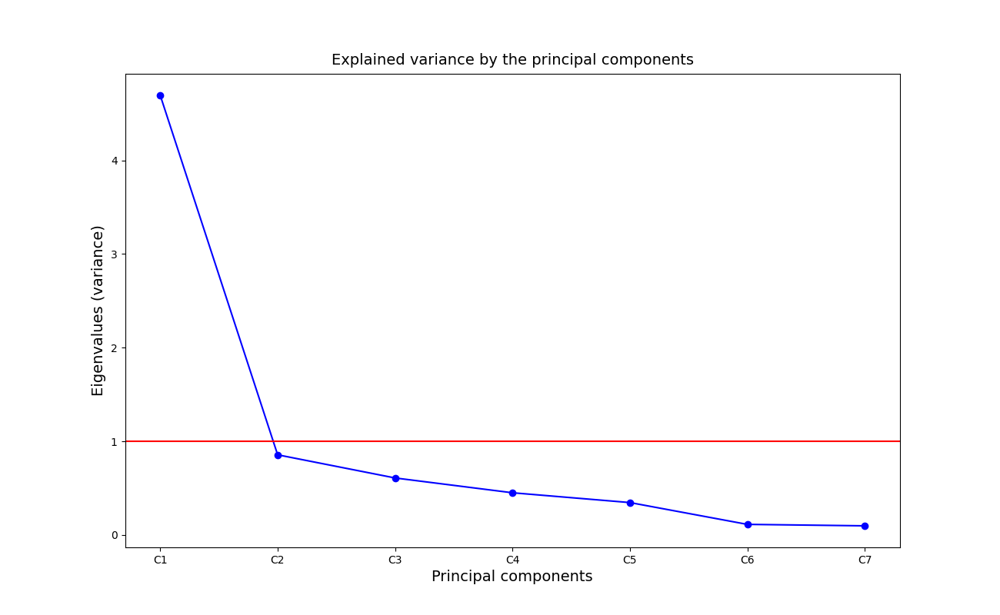
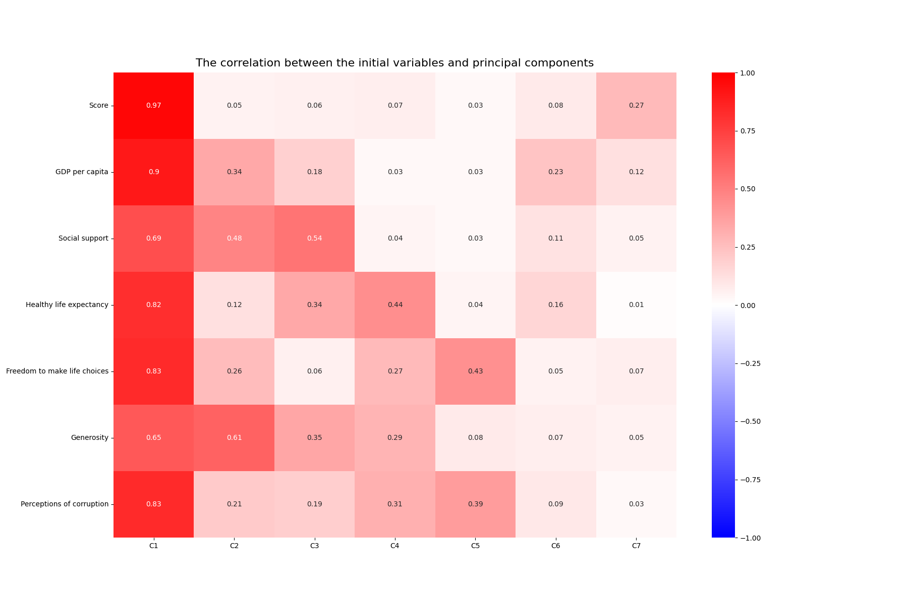
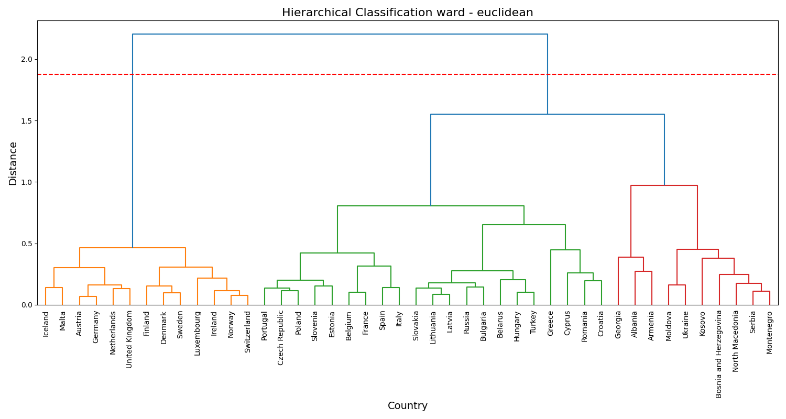

# Europe Happiness Analysis

## Dataset Information

### 1. Source

The dataset comes from the **Kaggle World Happiness Report**, containing data from the **Gallup World Poll (2019)**. The data includes happiness scores and various socio-economic indicators for different countries.

### 2. Description of Variables

The dataset initially contained **156 countries and 7 variables**, but we focused on **44 European countries** for this analysis. The key variables are:

- **Happiness Score (Score):** Life satisfaction rating (0-10 scale)
- **GDP per Capita:** Economic output per person
- **Social Support:** Availability of help from friends/family/community
- **Healthy Life Expectancy:** Expected years of healthy life
- **Freedom to Make Life Choices:** Perceived freedom in personal decision-making
- **Generosity:** Extent of charitable behavior
- **Perceptions of Corruption:** Trust in government and public institutions

## Analysis Approach

### 1. Principal Component Analysis (PCA)

PCA was applied to reduce dimensionality and identify key factors driving happiness. The scree plot showed that **the first two principal components (C1 and C2) are the most significant**, explaining the majority of variance.

#### Key Findings:

- **C1 (Socioeconomic Well-being):** High correlation with **GDP per capita, life expectancy, freedom, and corruption perceptions**
- **C2 (Social & Generosity Factor):** Driven by **social support and generosity**
- **C3 (Social & Health Factor):** Highlights **interpersonal relationships and health benefits**
- **C4-C7:** Represent governance, political freedom, and minor variations

### 2. Hierarchical Cluster Analysis (HCA)

HCA was used to group countries with similar happiness profiles. The **dendrogram revealed two main clusters:**

- **Cluster 1 (High-Income Nations - 13 countries):** Includes **Finland, Denmark, Norway, Iceland, Netherlands**. These countries have **high GDP, strong social systems, and low corruption.**
- **Cluster 2 (Diverse Economies - 30 countries):** Includes **France, Spain, Belgium, Czech Republic, Turkey**. More **socioeconomic diversity, lower GDP per capita, and varying governance challenges.**

Further subdivision within Cluster 2 suggests **regional or developmental differences.**

## Conclusions

- Economic stability, **social support, and governance play a crucial role in happiness.**
- High-income nations with **strong governance structures** rank highest in happiness.
- Countries with lower GDP and governance challenges show **greater variability in happiness.**
